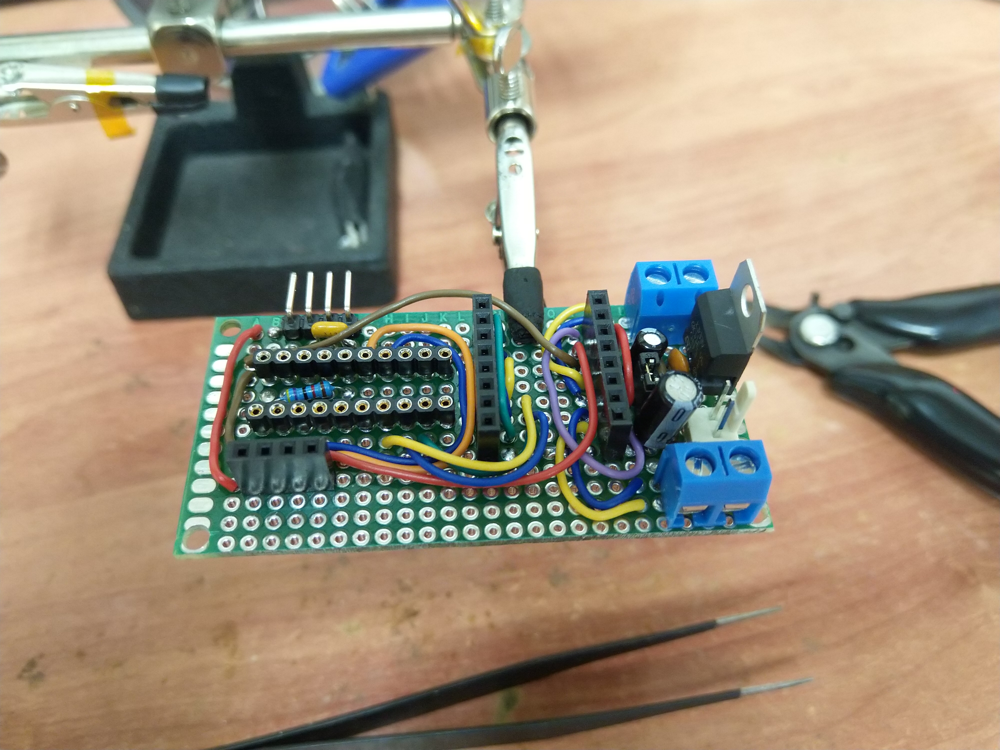
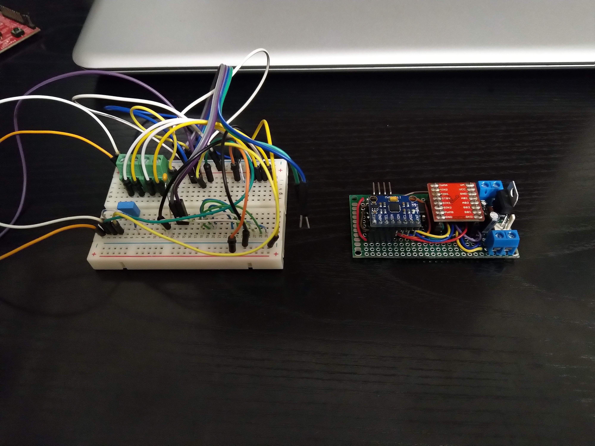
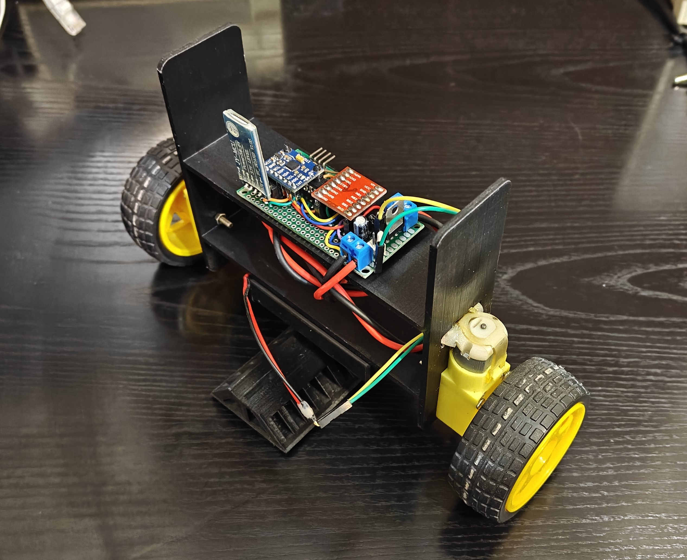

# msp-balance-bot
A balancebot made with a low-cost MSP430G2553 mcu.

This is an old project (started back in 2013) revisited and revised after some learning and after the adquisition of a 3D printer some years ago.

The code was slightly improved but it also has been improved by changing the chassis from acrylic sheets to 3d printed parts and moving all the components from a breadboard to a soldered proto-board.
All the main components were assembled into the proto-board using soldered female pin headers to easily remove them when needed and the motors are connected through screw terminal blocks.

The project was initially developed with Energia IDE for simplicity and compatibility with Arduino family.
It uses a MPU6050 breakout board as IMU, a TB6612FNG as H-bridge for the motors and a HC-06/05 BT module for wireless telemetry when debugging.

BalanceBot proto-board:

BalanceBot proto-board fully assembled and compared to breadboard circuit:

BalanceBot:

